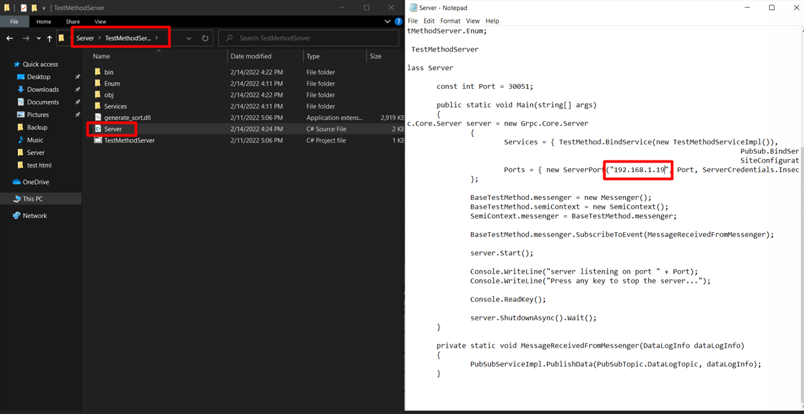
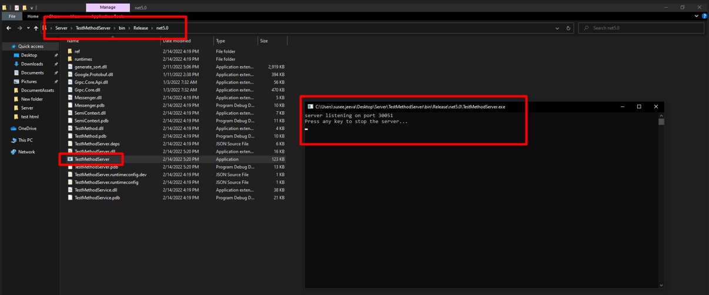
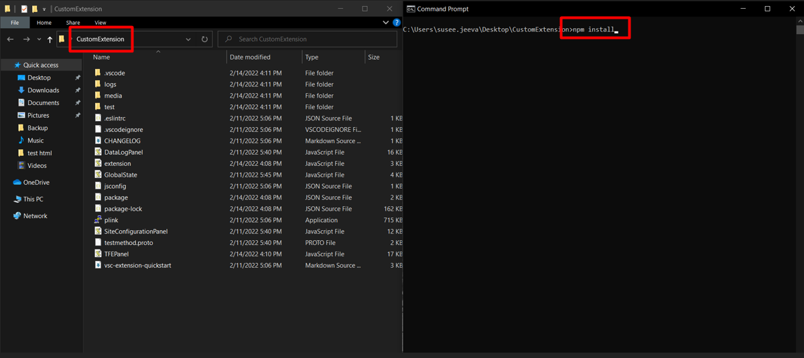
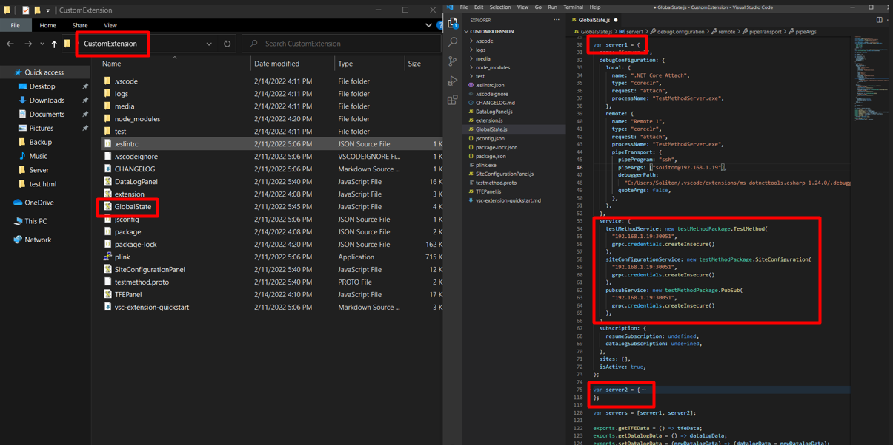
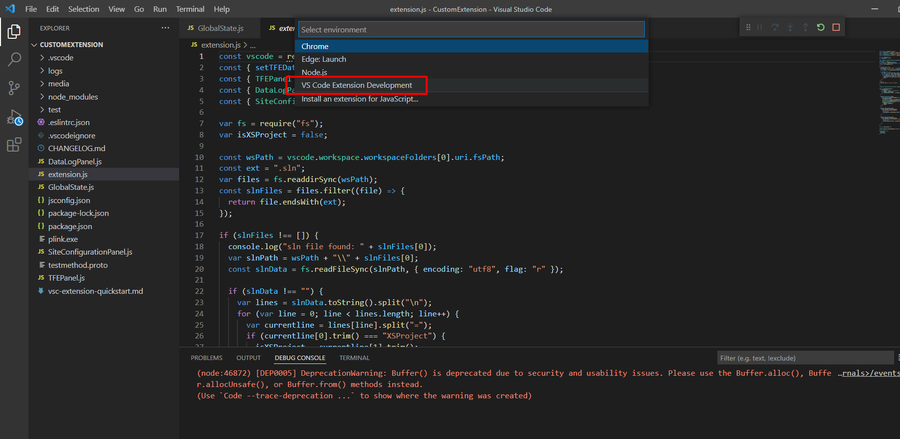
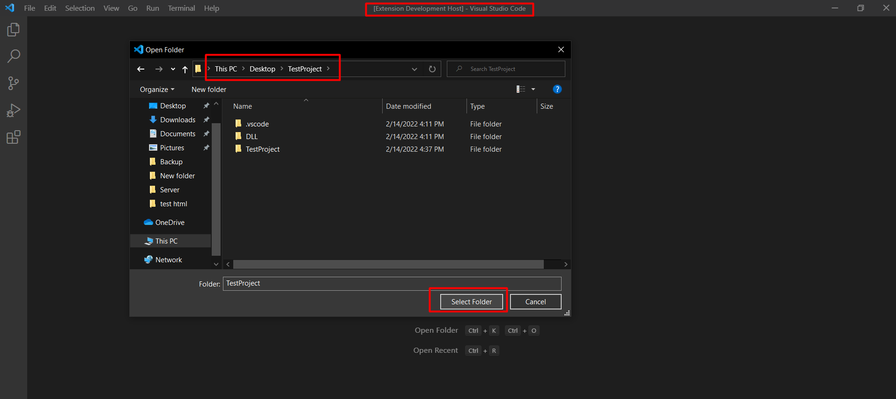
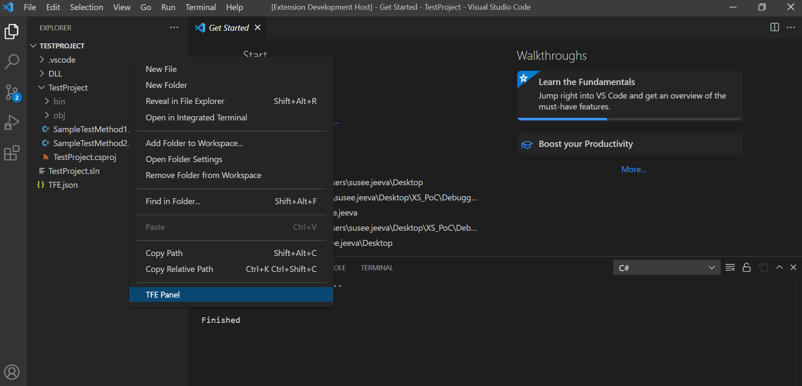
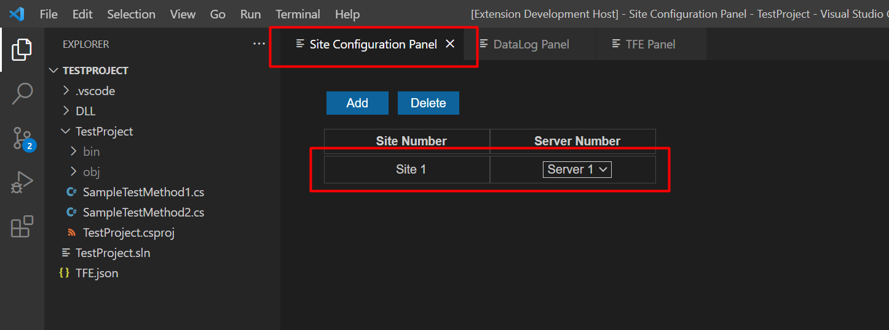
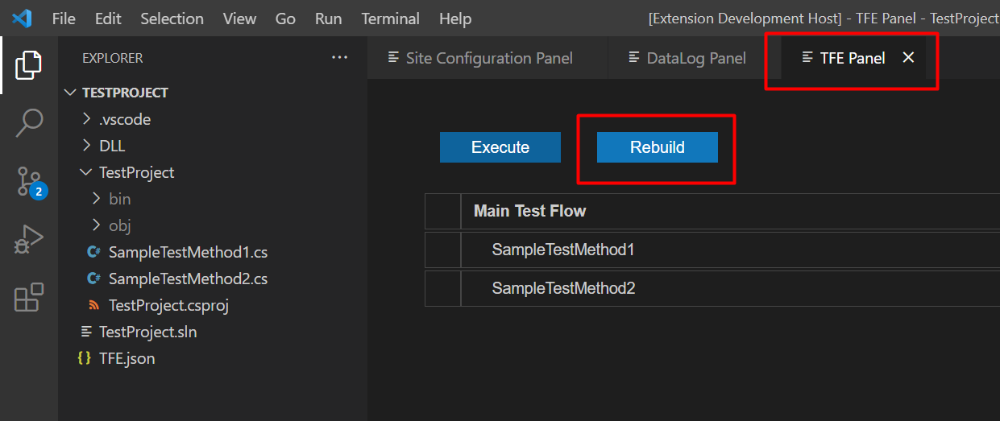
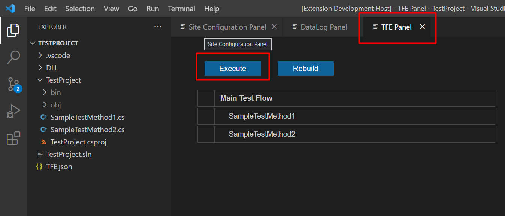

# Setup Prototype 1

This document helps to setup the prototype with the remote server

## Setting up Remote Server

- Install .NET 5.0 SDK
- Place the "Server" folder in the remote machine
- Update the Server's IP Address
  
- Build the server
  
- Start the server
  

## Setting up Custom Extension

- Install node modules
  
- Configure Server information (Note: In the below image, we are configuring for Server 1. The similar configuration needs to be done for Server 2 as well)
  
- Start the client (Click Run -> Start Debugging)
  

## Execute Test Program

- Open the test project
  
- Initiate all the panels (Right Click on Explorer Panel -> TFE Panel)
  
- Configure Site
  
- Rebuild Test Project (This will update the Test Project DLL in the server. Whenever there is a change in the Test Method, the user is expected to Rebuild Test Project)
  
- Execute Test Flow
  
- The Results will be displayed in the DataLog Panel
